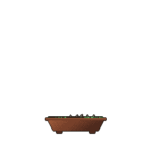

  
  
  

## 👋 About

<table>
<tr>
<td valign="middle">

I'm a DevOps engineer interested in Linux, Kubernetes, CI/CD and observability. I build small tools, mostly in **Go**, that make day-to-day operations easier, and I'm happy to contribute to open source projects in this space.

My personal website, [subrato.vercel.app](https://subrato.vercel.app), has my blog and more about me.

**Currently exploring:** Kubernetes tooling · observability · AI-assisted incident response with local LLMs

</td>
<td align="center" width="260">

 
A tree grown from my commit history

</td>
</tr>
</table>

## 🛠️ Tech I've worked with

  
   
  

## 📁 Projects

| Project | What it is | Stack |
|:--|:--|:--|
| 🔀 **AlertFlow** | Reads an Alertmanager config and draws the routing tree as an interactive diagram. You can type in a mock alert to see which route and receiver it would hit. It reuses Alertmanager's own matching logic and also works as a CLI for checking routing changes in CI. | Go, React, ReactFlow, Docker, Cobra |
| 🤖 **K8s ChatOps Bot** | A Slack bot for checking on a Kubernetes cluster from chat (`!pods`, `!logs`). Its `!diagnose` command sends failing pod events and logs to a local LLM for a root-cause summary, and it can watch for Warning events. Uses Slack Socket Mode, so no public webhooks. | Go, client-go, Slack API, Ollama |
| 🔍 **Service Health & Observability Platform** | Grafana dashboards for CPU, memory and HTTP metrics via Prometheus, with anomaly detection that flags problems before threshold alerts, and cgroups to simulate resource limits. | FastAPI, Docker, Prometheus, Grafana |
| 📈 **Real-Time Stock Data Pipeline** | A Kafka pipeline handling about 50K market events a day, with ETL into S3, schema management in Glue and queries in Athena. | Python, Kafka, S3, Glue, Athena |

## ✍️ Writing

Recent posts on [my blog](https://subrato.vercel.app/blogs.html):

- Build a Simple AI Helper That Watches Your Kubernetes Cluster
- Building a Kubernetes ChatOps Bot from Scratch (Go, Slack, & Strict RBAC)
- Building a Kubernetes Homelab from Scratch on Fedora

## 🏆 Highlights

- **Top 15 finalist**, Google Cloud Agentic AI Hackathon 2025 (700+ teams)
- **Shortlisted top 20**, Webathon Hackathon 2024 (200 teams)
- **Cloud Computing Lead**, Google Developer Student Clubs – JEC (2022–2024): helped 20+ peers get started with Kubernetes and cloud basics

## 📊 GitHub Stats

  

  

  <picture>
    <source media="(prefers-color-scheme: dark)" srcset="https://raw.githubusercontent.com/subratojec/subratojec/output/github-snake-dark.svg" />
    <source media="(prefers-color-scheme: light)" srcset="https://raw.githubusercontent.com/subratojec/subratojec/output/github-snake.svg" />
    
  </picture>

  <a href="https://subrato.vercel.app">subrato.vercel.app</a> · <a href="mailto:subratosingh@zohomail.in">subratosingh@zohomail.in</a>

